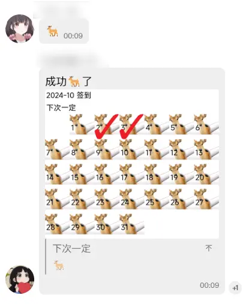
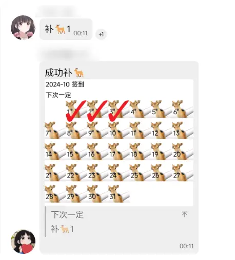
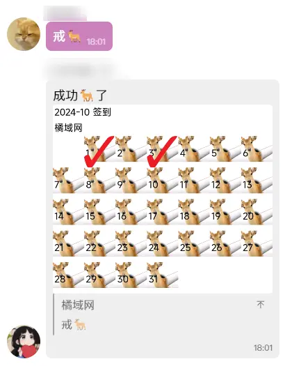
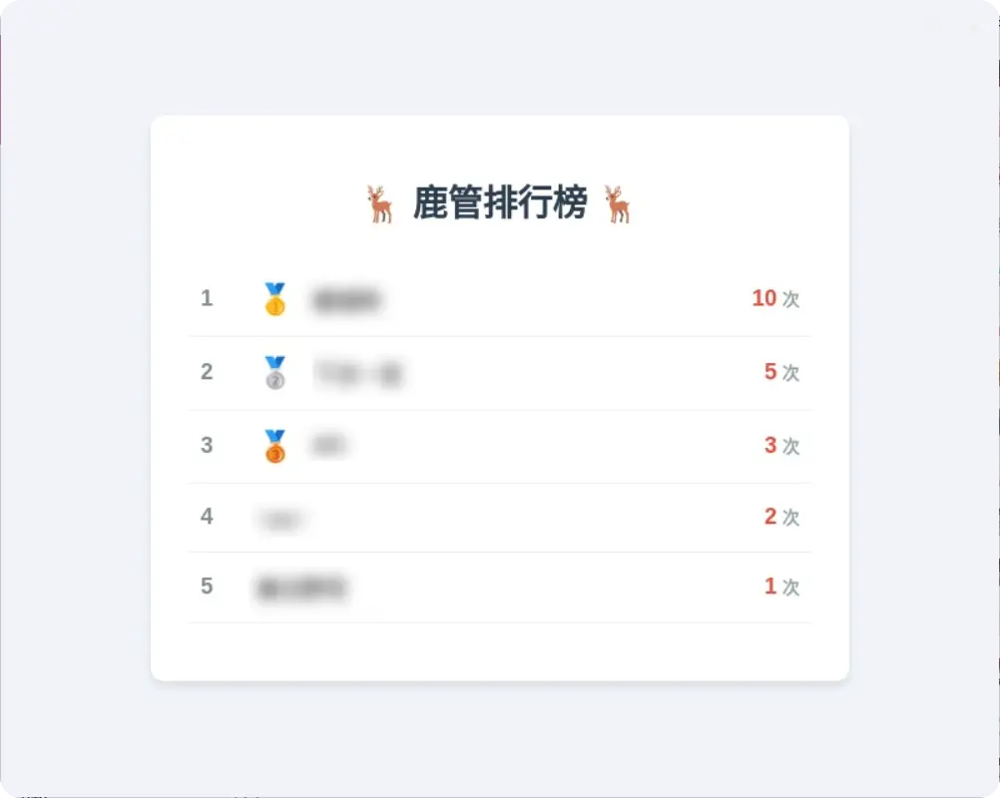
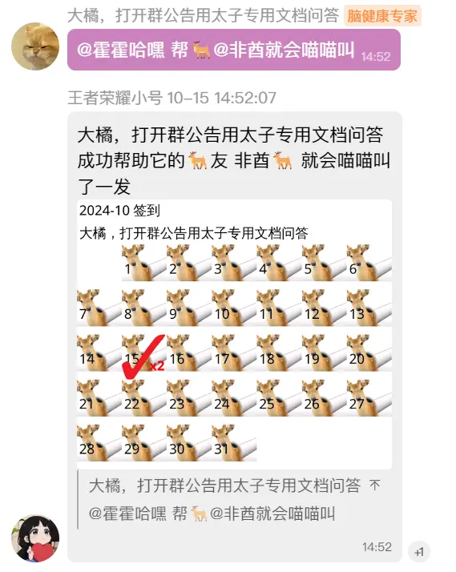

<div align="center">
  <a href="https://v2.nonebot.dev/store"></a>
</div>

<div align="center">

# yunzai-plugin-deer-pipe

_✨ 每月🦌管签到 ✨_
</div>

## 📖 介绍

一个🦌管签到小插件

> ➡️ 源想法和代码都来自：https://github.com/SamuNatsu/nonebot-plugin-deer-pipe
>
> ⚠️ 注：哥们大自然的搬运工，算法也只是稍微修改下

## 📸 效果展示










## 📔 下载插件

1. 克隆项目
```shell
# 国内
git clone https://gitee.com/kyrzy0416/yunzai-plugin-deer-pipe.git ./plugins/yunzai-plugin-deer-pipe/
# 海外 
git clone https://github.com/zhiyu1998/yunzai-plugin-deer-pipe.git ./plugins/yunzai-plugin-deer-pipe/
```

2. 安装依赖
```shell
pnpm i --filter=yunzai-plugin-deer-pipe
```

升级插件，发送以下到群：
```shell
#更新yunzai-plugin-deer-pipe
```

## 📦 命令合集


```shell
🦌
看🦌
补🦌 <日期> 以进行补签，如：补🦌 1（补签本月 1 日）
戒🦌
戒🦌 <日期> 以进行补签，如：戒🦌 1（戒签本月 1 日）
🦌榜
戒🦌榜
帮🦌
我的🦌友
```

✨ 帮🦌指南：
1. 让你的朋友`添加🦌友@你朋友` 或者 `添加🦌友+你朋友qq号` 或者 `添加🦌友`同时引用你朋友的话
2. 发送`帮🦌@你朋友` 或者 `帮🦌+你朋友qq号` 或者 `帮🦌`同时引用你朋友的话
3. 恭喜你帮他🦌了一发

> ps. 可以通过`我的🦌友`查看




##  🦌 友交流群


>  扫码不行就输入：575663150

## 🔗 相关链接

- 喵崽：[Yoimiya / Miao-Yunzai](https://gitee.com/yoimiya-kokomi/Miao-Yunzai)
- TRSS：[时雨◎星空 / Yunzai](https://gitee.com/TimeRainStarSky/Yunzai)
- 听语惊花：[听语惊花 / Yunzai-Bot-lite](https://gitee.com/Nwflower/yunzai-bot-lite)
- [插件库](https://gitee.com/yhArcadia/Yunzai-Bot-plugins-index)
- [锅巴插件](https://gitee.com/guoba-yunzai/guoba-plugin)
- [nonebot-plugin-deer-pipe](https://github.com/SamuNatsu/nonebot-plugin-deer-pipe)

## 🚀 声明

* 文件借鉴了很多插件，精简个人认为可以精简的内容。
* 素材来源于网络，仅供交流学习使用
* 严禁用于任何商业用途和非法行为
* 如果对你有帮助辛苦给个star，这是对我最大的鼓励
